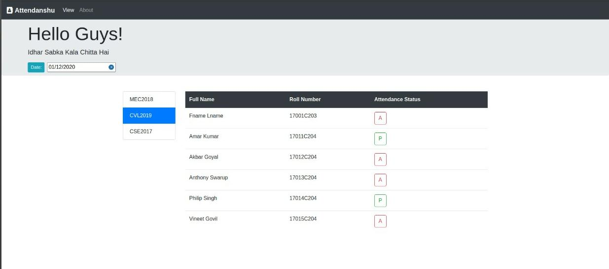

# Blockchain-attendance-system
    A multiple class attendance system on the Blockchain.
  
# Technology Stack
    html,css
    react
    drizzle
    truffle
    solidity
    ganache
    web3
  
 # Prerequisite
    npm - v6.0.0+
    node - v14.0.0+
 
 * `git clone https://github.com/dynamic-entropy/blockchain-attendance-system.git` #clone the project
 * `cd blockchain-attendance-system` # move into project folder
 * `npm i` #to install all dependencies for development
 
 # Terminal commands to launch the system
 * Run a truffle develop instance
    `truffle develop` #starts a local development blockchain
 * In the truffle develop console type 
    >`migrate --reset` //to run migrations to deploy the contracts
 * (Optionally) run a test to see if gananche instance is succesfully running
    >`test`
  * In a seperate instance/tab of terminal
    * `cd client-app` (move into client app, this was bootstrapped with create-react-app)
    * `npm start` (to start the client-app in development mode)
    
      
 # The DAPP
Every time you use Blockchain to store anything, you have to pay a gas fee. Hence, to reduce the cost paid in gas fee it is assumed that the institution will use a separate database to store the information of students in different classes. Here, we have used a hard coded Database as JSON objects for the same.

        A separate contract is written as well "BLC.sol" where the functionality of adding a class, student and then marking and saving their attendance is also implemented which can be used on Remix IDE but a separate front end is not designed for that contract (cuz money issues). 

* The teacher will be able to mark the attendance on the Blockchain of students present in the database.

* Both teacher and student will be able to see the attendance which was stored on blockchain before.

