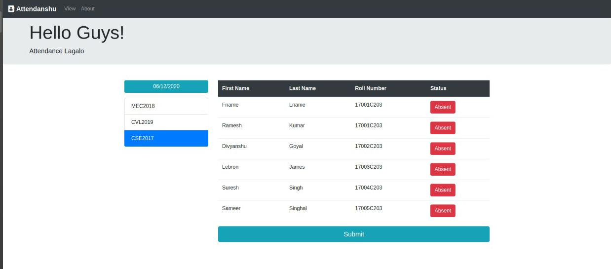

# Blockchain-attendance-system
    A multiple class attendance system on the Blockchain.
  
# Technology Stack
    html,css
    react
    drizzle
    truffle
    solidity
    ganache
    web3
  
 # Terminal commands to launch the system
    ganahce-cli(do not close this terminal)
    
    open a separate terminal in the project folder and
      npm start in clients folder,
      cd.. for going back to the original project folder,
      truufle develop,
      migrate --reset(to see the updated changes)
      
 # The DAPP
Every time you use Blockchain to store anything, you have to pay gas fee. Hence, to reduce the cost paid in gas fee it is assumed that the institution will use a separate database to store the information of students in different classes. Here, we have used a hard coded Database as JSON objects for the same.
○ The teacher will be able to see all the students of all the classes where he/she teaches to mark the attendance

